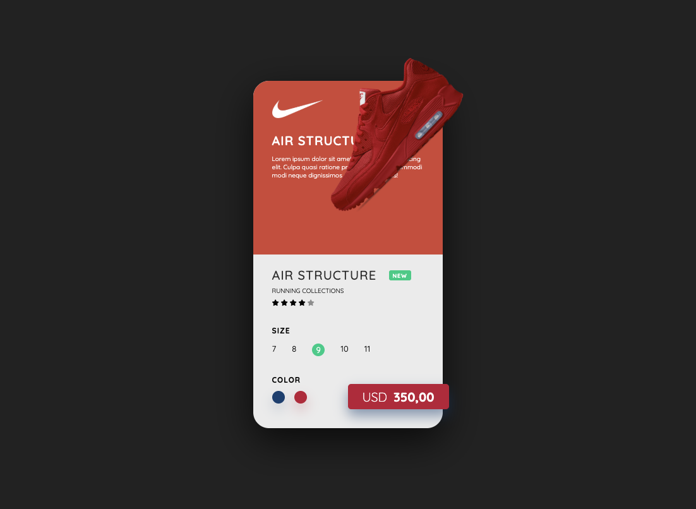

# 👟 Nike Shoe Card UI

A sleek, animated **Nike product card UI** built with HTML, CSS, and JavaScript. It includes dynamic color switching, product transitions, and a clean design inspired by real-world product displays.



---

## 🧩 Features

- 🟡 Clean, modern product card design
- 🎨 Interactive color switch with animation
- 👟 2 product images that transition on click
- 💸 Price display and size selection
- 🌟 Rating stars and “New” badge
- ⚡ Smooth transition effects using pure CSS

---

## 🛠 Technologies Used

- **HTML5**
- **CSS3** (with transitions and custom animations)
- **Vanilla JavaScript**
- **Font Awesome** (for icons)
- **Google Fonts** (Quicksand)

---

## 📷 Preview

> Click on a color dot to change the theme of the card and swap product images.

---

## 🚀 How to Run

1. Clone the repository:

```bash
git clone https://github.com/xandra-X/Nike-Product
